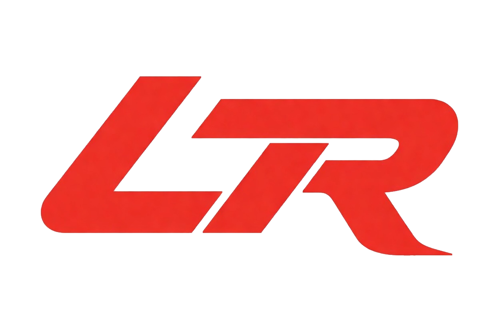

<p align="center">
  <picture>
    <source media="(prefers-color-scheme: dark)" srcset="packages/frontend/public/white_transparent.png" />
    <source media="(prefers-color-scheme: light)" srcset="packages/frontend/public/red_transparent.png" />
    
  </picture>
</p>

<h1 align="center">LightRace</h1>

<p align="center">
  Open-source LLM tracing and observability with remote tool invocation.
</p>

<p align="center">
  <a href="https://github.com/SKE-Labs/lightrace/stargazers"></a>
  <a href="https://github.com/SKE-Labs/lightrace/blob/main/LICENSE"></a>
  <a href="https://www.npmjs.com/package/@lightrace/cli"></a>
  <a href="https://pypi.org/project/lightrace/"></a>
  <a href="https://www.npmjs.com/package/lightrace"></a>
</p>

<p align="center">
  <a href="#quick-start">Quick Start</a> &middot;
  <a href="#sdks">SDKs</a> &middot;
  <a href="#features">Features</a> &middot;
  <a href="#langfuse-compatibility">Langfuse Compatible</a> &middot;
  <a href="#development">Development</a>
</p>

---

## Quick Start

Self-host LightRace with a single command using the [CLI](https://github.com/SKE-Labs/lightrace-cli):

**Install the CLI:**

```bash
# npm (recommended)
npm install -g @lightrace/cli

# Homebrew
brew install SKE-Labs/tap/lightrace

# Go
go install github.com/SKE-Labs/lightrace-cli@latest
```

**Start the server:**

```bash
lightrace init      # generate config with secrets
lightrace start     # pull images & start all services
```

Open [http://localhost:3000](http://localhost:3000) and log in with `demo@lightrace.dev` / `password`.

**Check status:**

```bash
lightrace status           # service health + URLs
lightrace status -o env    # export SDK connection vars
```

> **CLI commands:** `init` &middot; `start` &middot; `stop` &middot; `status` &middot; `logs [service]` &middot; `db migrate` &middot; `db reset` &middot; `version`
>
> Start with `--exclude frontend` for API-only mode.

---

## SDKs

Install the SDK for your language and start tracing:

### Python

```bash
pip install lightrace
```

```python
from lightrace import Lightrace, trace

lt = Lightrace(
    public_key="pk-lt-demo",
    secret_key="sk-lt-demo",
    host="http://localhost:3000",
)

@trace()
def run_agent(query: str):
    return search(query)

@trace(type="tool")  # remotely invocable from the UI
def search(query: str) -> list:
    return ["result"]

run_agent("hello")
lt.flush()
```

### TypeScript / JavaScript

```bash
npm install lightrace
```

```typescript
import { LightRace, trace } from "lightrace";

const lt = new LightRace({
  publicKey: "pk-lt-demo",
  secretKey: "sk-lt-demo",
  host: "http://localhost:3000",
});

const search = trace("search", { type: "tool" }, async (query: string) => {
  return ["result"];
});

const runAgent = trace("run-agent", async (query: string) => {
  return search(query);
});

await runAgent("hello");
lt.flush();
```

### Integrations

Both SDKs provide integrations for popular frameworks. Here are a few examples:

#### LangChain (Python)

```python
from langchain_core.messages import HumanMessage
from langchain_openai import ChatOpenAI
from lightrace import Lightrace
from lightrace.integrations.langchain import LightraceCallbackHandler

lt = Lightrace(public_key="pk-lt-demo", secret_key="sk-lt-demo")

handler = LightraceCallbackHandler(client=lt)
model = ChatOpenAI(model="gpt-4o-mini", max_tokens=256)

response = model.invoke(
    [HumanMessage(content="What is the speed of light?")],
    config={"callbacks": [handler]},
)

lt.flush()
lt.shutdown()
```

#### Claude Agent SDK (Python)

```python
import anyio
from claude_agent_sdk import AssistantMessage, ResultMessage, TextBlock
from lightrace import Lightrace
from lightrace.integrations.claude_agent_sdk import traced_query

lt = Lightrace(public_key="pk-lt-demo", secret_key="sk-lt-demo")

async def main():
    async for message in traced_query(
        prompt="Read the files in the current directory and summarize them.",
        options={"max_turns": 5},
        client=lt,
        trace_name="file-summarizer",
    ):
        if isinstance(message, AssistantMessage):
            for block in message.content:
                if isinstance(block, TextBlock):
                    print(block.text)
        elif isinstance(message, ResultMessage):
            print(f"Cost: ${message.total_cost_usd:.4f}")

    lt.flush()
    lt.shutdown()

anyio.run(main)
```

#### Claude Agent SDK (TypeScript)

```typescript
import { Lightrace } from "lightrace";
import { tracedQuery } from "lightrace/integrations/claude-agent-sdk";

const lt = new Lightrace({ publicKey: "pk-lt-demo", secretKey: "sk-lt-demo" });

for await (const message of tracedQuery({
  prompt: "Read the files in the current directory and summarize them.",
  options: { maxTurns: 5 },
  client: lt,
  traceName: "file-summarizer",
})) {
  if (message.type === "result") {
    const r = message as Record<string, unknown>;
    console.log(r.result);
  }
}

lt.flush();
await lt.shutdown();
```

> See the full list of integrations: [Python SDK](https://github.com/SKE-Labs/lightrace-python#integrations) &middot; [JS SDK](https://github.com/SKE-Labs/lightrace-js#integrations)

### Trace Types

Both SDKs support the same observation types:

| Type         | Description                                           |
| ------------ | ----------------------------------------------------- |
| _(default)_  | Root trace — top-level unit of work                   |
| `span`       | Generic child operation                               |
| `generation` | LLM call (tracks model, tokens, cost)                 |
| `tool`       | Tool function — remotely invocable from the dashboard |
| `chain`      | Logical grouping of steps                             |
| `event`      | Point-in-time marker                                  |

Set `invoke=False` (Python) or `invoke: false` (JS) on a tool to trace it without registering for remote invocation.

---

## Features

- **Trace & observe** — hierarchical trace viewer with token usage breakdown, latency, and cost
- **Remote tool invocation** — re-run any `@trace(type="tool")` function directly from the dashboard
- **Real-time updates** — live trace streaming via WebSocket (Redis Pub/Sub)
- **Tools page** — see connected SDK instances, registered tools, and their schemas
- **API key management** — create and rotate keys per project
- **Multi-project RBAC** — Owner, Admin, Member, and Viewer roles per project

---

## Langfuse Compatibility

LightRace is drop-in compatible with Langfuse v3 and v4 SDKs. Point any Langfuse SDK at your LightRace instance:

```bash
export LANGFUSE_PUBLIC_KEY=pk-lt-demo
export LANGFUSE_SECRET_KEY=sk-lt-demo
export LANGFUSE_HOST=http://localhost:3000
```

Both `POST /api/public/ingestion` (v3 JSON batch) and OpenTelemetry (v4 OTLP) endpoints are supported.

---

## Architecture

Monorepo with three packages:

```
packages/
  shared/    — Prisma schema, DB + Redis clients, Zod validation
  backend/   — Hono server (tRPC + REST ingestion + OTel + tool registry)
  frontend/  — Next.js 15 dashboard + Auth.js
```

Infrastructure: **PostgreSQL + Redis + Caddy**, all managed as containers.

All traffic enters through Caddy on a single port (default `3000`):

| Route           | Target                                           |
| --------------- | ------------------------------------------------ |
| `/api/public/*` | Backend — SDK ingestion, OTLP, tool registration |
| `/trpc/*`       | Backend — tRPC queries and mutations             |
| `/ws`           | Backend — WebSocket (real-time subscriptions)    |
| `/*`            | Frontend — dashboard and auth                    |

---

<details>
<summary><h2>Development</h2></summary>

### Setup

```bash
# Start infrastructure (Postgres + Redis)
docker compose up -d postgres redis

# Install dependencies
pnpm install

# Copy per-package env files
cp packages/shared/.env.example packages/shared/.env
cp packages/backend/.env.example packages/backend/.env
cp packages/frontend/.env.example packages/frontend/.env

# Generate Prisma client, run migrations, seed demo data
pnpm db:generate && pnpm db:migrate && pnpm db:seed

# Start all services (frontend :3001, backend :3002)
pnpm dev
```

Dashboard in dev mode: [http://localhost:3001](http://localhost:3001)

### Scripts

| Command            | Description                    |
| ------------------ | ------------------------------ |
| `pnpm dev`         | Start all services (Turborepo) |
| `pnpm build`       | Build all packages             |
| `pnpm typecheck`   | TypeScript check               |
| `pnpm test`        | Run tests (Vitest)             |
| `pnpm format`      | Format (Prettier)              |
| `pnpm db:generate` | Generate Prisma client         |
| `pnpm db:migrate`  | Run Prisma migrations          |
| `pnpm db:seed`     | Seed demo data                 |
| `pnpm db:studio`   | Open Prisma Studio             |

### Tech Stack

Next.js 15 &middot; Hono &middot; tRPC v11 &middot; Prisma 7 &middot; PostgreSQL &middot; Redis &middot; Caddy &middot; Auth.js v5 &middot; Tailwind CSS v4 &middot; Turborepo

### Environment Variables

**Docker Compose (`.env`):**

| Variable           | Description                          |
| ------------------ | ------------------------------------ |
| `GATEWAY_PORT`     | Caddy exposed port (default: `3000`) |
| `PUBLIC_URL`       | Public URL of the instance           |
| `DB_PASSWORD`      | PostgreSQL password                  |
| `AUTH_SECRET`      | Auth.js JWT secret                   |
| `INTERNAL_SECRET`  | Frontend-backend shared secret       |
| `LIGHTRACE_DOMAIN` | Set for automatic HTTPS via Caddy    |

Per-package `.env` files are documented in each package's `.env.example`.

</details>

---

## Related

|                                                                      |                                 |
| -------------------------------------------------------------------- | ------------------------------- |
| [**Lightrace CLI**](https://github.com/SKE-Labs/lightrace-cli)       | Self-host with a single command |
| [**lightrace-python**](https://github.com/SKE-Labs/lightrace-python) | Python SDK                      |
| [**lightrace-js**](https://github.com/SKE-Labs/lightrace-js)         | TypeScript/JavaScript SDK       |

## License

MIT
